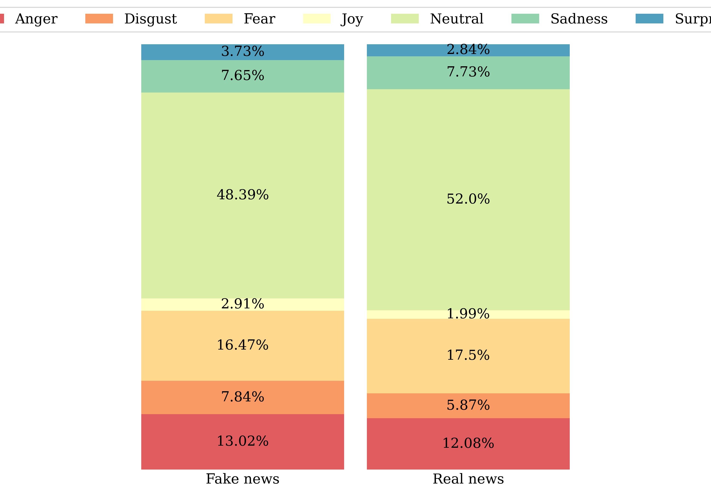
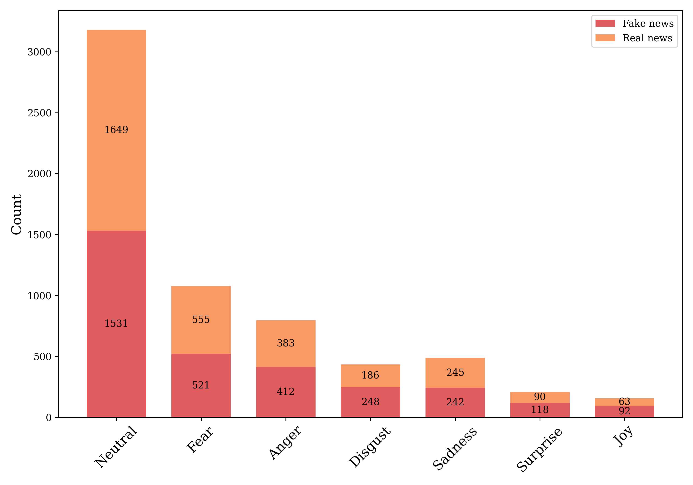

# Emotion classification using fine-tuned transformers
Assignment 4 for language analytics (S2023). This repository contains code for running emotion classification on headlines from a dataset of fake and real news. Furthermore, it holds code for plotting the results, as well as creating a table of the counts of each emotion for both real and fake news.

## Description of data
The data used in this assignment is from Kaggle, and can be found through this [link](https://www.kaggle.com/datasets/jillanisofttech/fake-or-real-news). It contains the title, text, and label of 7796 news articles. The label indicates whether the article is fake or real. The emotion classification was performed on the headlines of the news articles. 


## Usage and reproducibility
To reproduce the results follow the steps below. All terminal commands should be run from the root of the directory.
1. Clone the repository
2. Download the data from the link above, and place it in the `data` folder (see repository structure)
3. Create a virtual environment and install the required packages
```
bash setup.sh
```
4. Run emotion classification and generate plots
```
bash run.sh
```
The pipeline was developed and tested on [uCloud](https://cloud.sdu.dk/app/dashboard)(Ubuntu v22.10m, Coder python v1.77.3, python v3.10.7).


## Repository structure
```
├── data                        <- data folder (not included in the github repo)
│   ├── classified_emotions.csv
│   └── fake_or_real_news.csv
├── figs
│   ├── emotion_counts.png
│   └── emotion_proportions.png
├── src
│   ├── emotion_classification.py
│   └── summarise_results.py
├── assignment_description.md
├── README.md
├── requirements.txt
├── run.sh
└── setup.sh
```

## Results
The table below shows the percentage of headlines that were classified as having a certain emotion in fake news, real news, and the total dataset.

| label   |   anger |   disgust |   fear |   joy |   neutral |   sadness |   surprise |
|:--------|--------:|----------:|-------:|------:|----------:|----------:|-----------:|
| FAKE    |   13.02 |      7.84 |  16.47 |  2.91 |     48.39 |      7.65 |       3.73 |
| REAL    |   12.08 |      5.87 |  17.5  |  1.99 |     52    |      7.73 |       2.84 |
| Total   |   12.55 |      6.85 |  16.99 |  2.45 |     50.2  |      7.69 |       3.28 |

As evident from the table and the plot below, the news headlines in real and fake news have similar proportions of emotions. Small differences can be seen in the proportion of anger and disgust, which is slightly higher in fake news, and the proportion of neutral, which is slightly higher in real news.



Generally across both fake and real news, we see that the majority of headlines are classified as neutral, followed by fear and anger.


